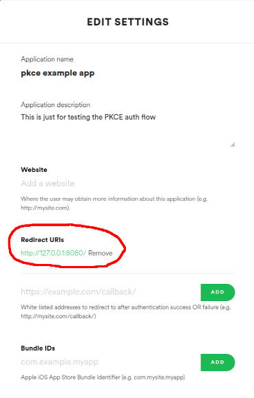

# Spotify Web Authorization with PKCE
This is a minimal example to try out the Spotify Authorization flow with PKCE.

I highly recommend to read the offical Spotify guide about authorization: https://developer.spotify.com/documentation/general/guides/authorization-guide/#authorization-code-flow-with-proof-key-for-code-exchange-pkce

In order to test this project you need to create an app in your Spotify Dashboard: https://developer.spotify.com/dashboard/applications

Here you will find the `CLIENT_ID` that you need to copy inside the `main.js` on line 233.

Don't forget to also add the redirect URI to your application.

## Install and run
To locally host this example `http-server` is used.

First install the dependecies by running `npm install`.

Then serve the files in the `public` folder via `npm run`

### Thanks to
https://github.com/curityio/pkce-javascript-example

https://github.com/spotify/web-api-auth-examples
